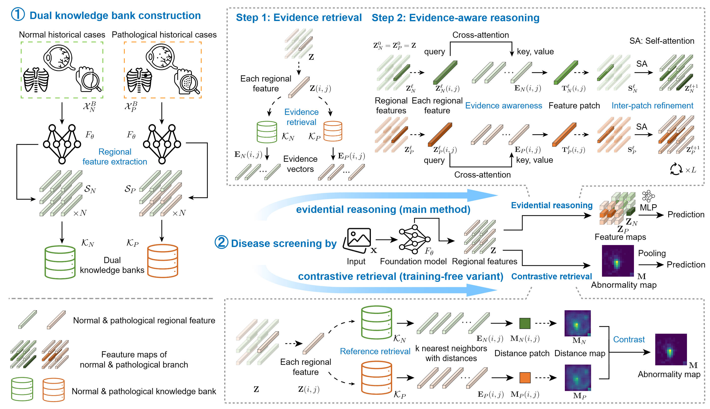

# EviScreen

This is the release code for **Evidential Reasoning Advances Interpretable Real-World Disease Screening** (ICML 2026).



The repository contains the fundus workflow used for reproduction:

1. prepare fundus CSV files and preprocessed images;
2. build normal/pathological knowledge banks;
3. run the released model directly;
4. train the knowledge banks and evidential reasoning head.

## Environment

Create the two Conda environments:

```bash
conda env create -f environment-env_bank.yml
conda activate env_bank
pip install -r requirements-env_bank.txt
```
```bash
conda env create -f environment-env_reasoning.yml
conda activate env_reasoning
pip install -r requirements-env_reasoning.txt
```

Use `env_bank` for data preparation, knowledge-bank construction, retrieval, and metrics. Use `env_reasoning` for the Stage 2 evidential reasoning head.

Set local paths once before running the scripts, or edit the same values in `constants.sh`:

```bash
export EVISCREEN_ENV_ROOT=/path/to/miniconda3/envs
export EVISCREEN_RAW_ROOT=/path/to/raw_dataset
```

## Prepare Data

Download the raw datasets and place them under one root:
[BRSET](https://physionet.org/content/brazilian-ophthalmological/1.0.1/),
[EDDFS](https://github.com/xia-xx-cv/EDDFS_dataset/) with [annotations](https://github.com/xia-xx-cv/EDDFS_dataset/tree/main/datas/EDDFS/Annotation),
[RIADD](https://riadd.grand-challenge.org/Download/), and
[JSIEC](https://www.kaggle.com/datasets/linchundan/fundusimage1000)


```text
raw_dataset/
  brazilian-ophthalmological/1.0.1/
    labels_brset.csv
    fundus_photos/
  EDDFS/
    OriginalImages/
    train.csv
    test.csv
  RIADD/
    train_set/
    val_set/
    test_set/
  JSIEC/
    1000images/
```

Preprocess fundus images and generate CSV files:

```bash
bash stage_0_data_preparation/preprocess_fundus_images.sh

bash stage_0_data_preparation/generate_fundus_csv.sh
```

The generated CSV root is:

```text
stage_0_data_preparation/fundus_csv
```

## Prepare Trained Models

Download [`RETFound_dinov2_meh.pth`](https://huggingface.co/YukunZhou/RETFound_dinov2_meh) and place it at:

```text
stage_1_dual_knowledge_bank_construction/ckpt/RETFound_dinov2_meh.pth
```

For direct reproduction with released EviScreen models, download the trained models from [Google Drive](https://drive.google.com/file/d/1l8XgCqLt2IwSrltHLBrVf7wORyPdDYjm/view?usp=sharing) and organize them as:

```text
model_for_evaluation/
  normal/
    knowledge_bank_params.pkl
    nnscorer_search_index.faiss
  pathological/
    knowledge_bank_params.pkl
    nnscorer_search_index.faiss
  model.pth
```

## Reproduce Directly

Evaluate the released dual knowledge banks (training-free variant):

```bash
bash reproduce_directly/evaluate_model_for_evaluation.sh
```

Evaluate the released Stage 2 evidential reasoning head (main method):

```bash
bash reproduce_directly/evaluate_stage2_direct_retrieval.sh
```

Outputs are written under `reproduce_directly/eval` and `reproduce_directly/eval_stage2_direct`.

## Train

Build the dual knowledge banks:

```bash
bash stage_1_dual_knowledge_bank_construction/build_dual_knowledge_banks.sh
```

Train the Stage 2 evidential reasoning head:

```bash
bash stage_2_evidential_reasoning/run_stage2_training.sh
```

After training, evaluate the trained Stage 2 head:

```bash
bash stage_2_evidential_reasoning/evaluate_stage2_training.sh
```

## Acknowledgements
Some code and foundation models of this repository are based on [PatchCore](https://github.com/amazon-science/patchcore-inspection), [RETFound](https://github.com/rmaphoh/RETFound), [CheXFound](https://github.com/RPIDIAL/CheXFound), and [PanDerm](https://github.com/SiyuanYan1/PanDerm).
